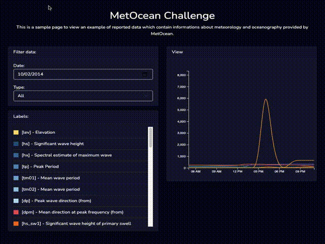
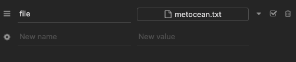
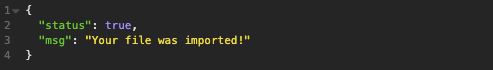
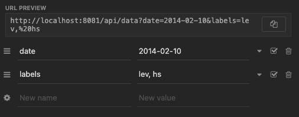
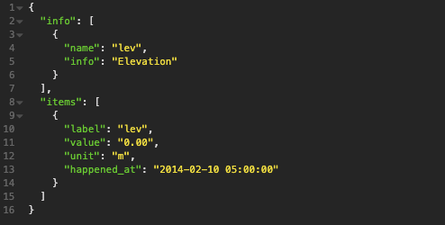

<h4 align="center">
  MetOcean Challenge
</h4>

  <a href="#-preview">Preview</a>&nbsp;&nbsp;&nbsp;|&nbsp;&nbsp;&nbsp;
  <a href="#-tecnologies">Tecnologies</a>&nbsp;&nbsp;&nbsp;|&nbsp;&nbsp;&nbsp;
  <a href="#-project">Project</a>&nbsp;&nbsp;&nbsp;|&nbsp;&nbsp;&nbsp;
  <a href="#-api-docummentation">API Docummentation</a>&nbsp;&nbsp;&nbsp;|&nbsp;&nbsp;&nbsp;
  <a href="#-how-to-deploy-it-with-docker">How to deploy it with docker</a>&nbsp;&nbsp;&nbsp;|&nbsp;&nbsp;&nbsp;
  <a href="#memo-license">License</a>

 

## Preview

You could see this project on the link [MetOcean - Challlenge](https://metocean-challenge.herokuapp.com)

## 💻 Tecnologies

This project was developed with the following tecnologies:

- [Laravel](https://laravel.com)
- [Vue](https://vuejs.org/v2/guide/)
- [Vuex](https://vuex.vuejs.org/)
- [Vue Router](https://router.vuejs.org/)
- [D3](https://d3js.org/)

## 🔖 Project

This project was developed with the objective of implementing an api to import data from a txt file and provide them to a frontend where it is possible to visualize and manipulate the data.

## Project structure
Currently, the project was implemented following a MVC (Model View Controller) structure, the frontend is inserted within the context of laravel just to facilitate the deployment process for heroku, but it would be possible to remove the frontend from the context of laravel for more versatility.

## Infrastructure
Currently the project is implemented in heroku in a dyno-free but the application is distributed over containers using the docker, where it is possible to have stability and proximity to similar environments for development and production.

## Frontend
I used the frontend with Vuejs and D3js to render the visualization of the data obtained by the API and using Vuex to manage the app state, centralizing the information in the app state so that the components can benefit from it, reducing the requests for the api.

## API
The API was developed using the REST API framework without JWT authentication. It has a resource with two methods that can be consumed.

### API - Available resources
There is currently only one resource below that you can manipulate through the methods. **GET**, **POST**:

- Data (data)

### API - Data processing
All data sent and received by the API must be in JSON format (application/json).

### API - Authentication
Currently none of the methods require authentication.

### API - Endpoints
**API BASE URL** `https://metocean-challenge.herokuapp.com/api`

#### Endpoint: /data [POST]
This method allows you to insert or update data in the database, based on the .txt file sent in the body of your request.

- Example request body

- Example response body

#### Endpoint: /data [GET]
This method returns data from the database in which it is also possible to filter the data by entering some parameters via query strings.

Example request

Example response body

## 🤔 How to deploy it with docker
- [Install docker](https://www.docker.com/get-started)
- Open your terminal and go to the project path
- Run the command `docker-compose up -d`
- Create your database inside the container `docker-compose exec mysql bash`
- Create a new file .env with your variables;
- Install dependencies by running the command `docker-compose exec app composer install`
- Run the database migrations by using the command `docker-compose exec app php artisan migrate`
- Access your project using the url `http//localhost:8081`

## :memo: License

This project is under MIT license. See the [LICENSE](LICENSE.md) for more details.
